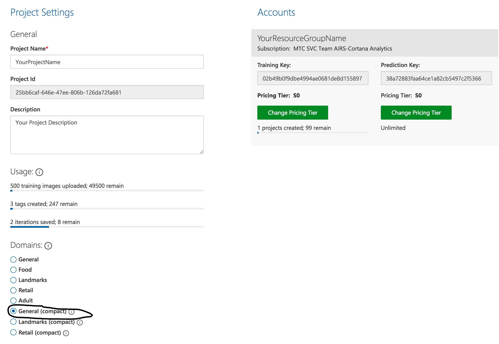

# Export your model as a docker container
Custom Vision Service allows classifiers to be exported to run offline. You can embed your exported classifier into an application and run it locally on a device for real-time classification.

Custom Vision Service supports the following exports:

- Tensorflow for Android.
- CoreML for iOS11.
- ONNX for Windows ML.
- A Windows or Linux container. The container includes a Tensorflow model and service code to use the Custom Vision Service API.

In this section of the lab we will demonstrate how to export your trained classifier as a docker container.

Custom Vision Service only exports compact domains. The models generated by compact domains are optimized for the constraints of real-time classification on low powered devices. Classifiers built with a compact domain may be slightly less accurate than a standard domain with the same amount of training data.

## Convert to a compact domain

If your classifier was not trained with the compact domain (which is the case for the classifier trained during the first stage of the lab) you need to convert it.

To convert the domain of an existing classifier, use the following steps:

1. From the Custom vision page, select the Home icon to view a list of your projects. You can also use the https://customvision.ai/projects to see your projects.
2. Select your project, and then select the Gear icon in the upper right of the page.
3. In the **Domains** section, select a compact domain. **Save Changes** to save the changes.


4. Retrain the model using a compact domain


## Export the model to a docker image
To export the model after retraining, use the following steps:
1. Go to the Performance tab and select Export.
2. Select the export format (Docker), and then select Export to download the model.
3. Extract the downloaded `zip` file to the folder of your choice

The instructor will walk you through the content of the download.
 
## Deploy a custom vision service container to Azure Container Instance

## Create a docker image from the exported zip file

## Create a resource group
```
az group create --name <resource group> --location <location>
```

## Create a container
```
az container create --resource-group <resource group> --name <container name> --image <image name> --dns-name-label <dns prefix> --ports 80
```

## Show the container's status
```
az container show --resource-group <Your resource group> --name <Container name> "
```
## Invoke the prediction point in the container
```
curl -X POST http://<container FQDN>/image -F imageData=@<image file>
